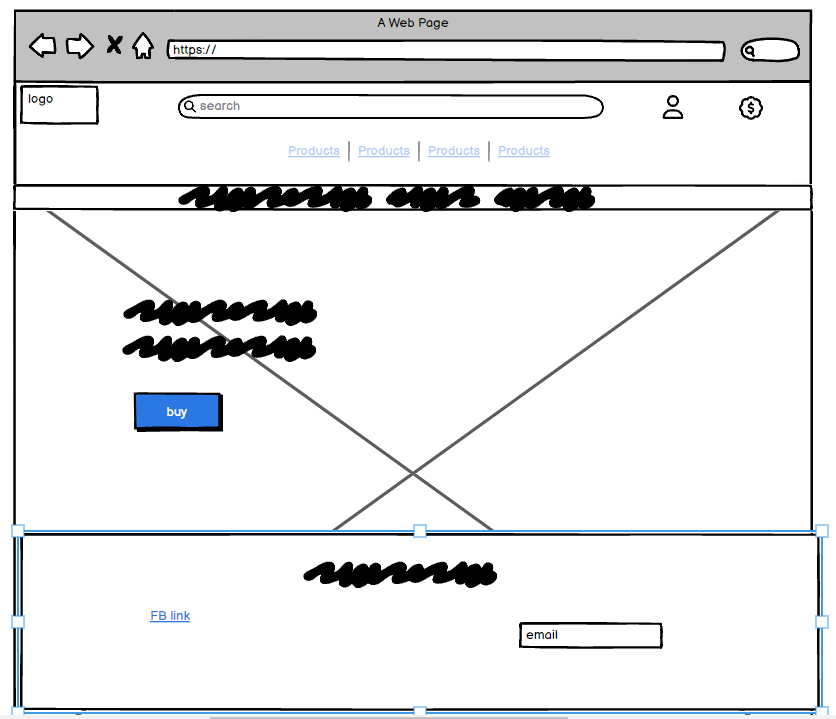

# MATES E-SHOP


## E-commerce Store for Chess Enthusiasts
> The e-commerce chess store sells a variety of chess sets and accessories online, providing a convenient shopping experience for chess enthusiasts of all levels.


### - By Tomas Karavasilev

## **[LIVE SITE](https://matesapp-6452160599de.herokuapp.com/) | [REPOSITORY](https://github.com/Karoskodev/mates)**

---

## Table of contents
<a name="contents">Back to Top</a>
 1. [ UX ](#ux)
 2. [ Business Model ](#business)
 3. [ SEO ](#seo)
 4. [Agile Development](#agile)
 5. [ Features ](#features)  
 6. [ Features Left to Implement ](#left)  
 7. [ Technology used ](#tech) 
 8. [ Testing ](#testing)  
 9. [ Bugs ](#bugs)  
 10. [ Deployment](#deployment)
 11. [ Credits](#credits)
 12. [ Content](#content)  
 13. [ Acknowledgements](#acknowledgements)  

 ---

 ## UX

 <a name="ux"></a>
 ### Color pallete

 I tried to stick with the colors reminiscent of the chessboard, chess pieces and wood.
 <br>
 
 

 ### Database Schema

 

 ---
### Models
<br>


#### Order Model


| id | Field |
|--|--|
|order_number|CharField|
|user_profile|ForeignKey|
|full_name|CharField|
|email|EmailField|
|phone_number|CharField|
|country|CountryField|
|postcode|CharField|
|town_or_city|CharField|
|street_address1|CharField|
|street_address2|CharField|
|county|CharField|
|date|DateTimeField|
|delivery_cost|DecimalField|
|order_total|DecimalField|
|grand_total|DecimalField|
|original_bag|TextField|
|stripe_pid|CharField|


#### OrderLineItem Model


| id | Field |
|--|--|
|order|CharField|
|product|ForeignKey|
|quantity|CharField|
|lineitem_total|EmailField|


#### Product Model


| id | Field |
|--|--|
|category|ForeignKey|
|sku|CharField|
|name|CharField|
|description|TextField|
|price|DecimalField|
|rating|DecimalField|
|image_url|URLField|
|image|ImageField|


#### Category Model


| id | Field |
|--|--|
|name|CharField|
|friendly_name|CharField|


#### User Profile Model

| id | Field |
|--|--|
|user|OneToOneField|
|user_image|imagefield|
|user_title|charfield|
|user_nickname|charfield|
|phone_number|charfield|
|street address1|charfield|
|street address2|charfield|
|county|charfield|
|postcode|charfield|
|town or city|charfield|
|country|countryfield|


#### Post Model


| id | Field |
|--|--|
|title|CharField|
|slug|SlugField|
|featured_image|DateTimeField|
|updated_on|DateTimeField|
|created_on|DecimalField|
|content|TextField|
|status|IntegerField|


#### Contact Model


| id | Field |
|--|--|
|subject|CharField|
|email|EmailField|
|message|TextField|
|created_at|DateTimeField|

[Back to Top of page](#contents)

## UX design

### Wireframes

<br>
Main page:


<br>
Products page:


<br>
Product Detail page:


<br>
Shoping Bag page:


<br>
Blog page:


<br>
Contact form page:


<br>

[Back to Top of page](#contents)

---

## Business Model

<a name="business"></a>

#### Business Overview
Mates Chess Eshop is a B2C e-commerce platform specializing in chess-related products, aiming to provide high-quality chess sets, boards, and accessories to customers worldwide through an online store.

Benefits for the Business Owner:
1. Scalability: Easily expand the business as it grows.
2. No Physical Location: No need for a brick-and-mortar store, allowing for global reach.
3. Global Targeting: Cater to customers worldwide, targeting chess enthusiasts.
4. Niche Branding: Focus on a specific niche, building a brand that resonates with chess players.
5. Low Startup Cost: Begin with a relatively low initial investment, allocating more budget to customer acquisition and marketing.
6. Impulse Buying: The lower price point encourages impulse purchases from customers.

Cons:
1. Initial Customer Acquisition: Overcoming industry saturation to attract initial customers.
2. Brand Establishment: Building a brand from scratch requires time and a solid marketing strategy.
3. Marketing Effort: Manual marketing or paid advertising is essential for gaining organic traffic.
4. Trust Building: Absence of physical presence may make it challenging to build trust without discounts or offers.

---

#### Site User

User 1:
The typical site user is a chess enthusiast, male, aged between 10 and 80, interested in chess. They seek quality chess products to enhance their gaming experience.

User 2:
Additional users include partners of User 1, browsing for gifts catering to the chess interest.

---

#### Goals for the Website:

User-Friendly Interface: Ensure an easy-to-navigate website with a clear purpose.
Product Satisfaction: Provide products that meet user expectations.
Quick Checkout: Facilitate a seamless checkout process.
User Profiles: Enable users to create profiles, view past orders, and update information.

---

#### Marketing Strategy

Goals:

1. Facebook Promotion: Leverage the Facebook business page for store promotion.
2. Social Network Sharing: Encourage friends and family to share the page, enhancing visibility.
3. Soft Launch Sale: Initiate a soft online launch sale to stimulate early adoption and purchases.
4. Subscriber Engagement: Use Mailchimp to gather subscribers and send promotions for repeat business.
5. SEO Content: Develop meaningful articles and blog posts to enhance SEO ranking on search engines.
6. Paid Advertising: Utilize platforms like Google Ads and Facebook Ads to reach the target demographic.
7. Product-Centric Ads: Run multiple ads featuring different chess products, analyzing and focusing on high-performing ones.
8. Influencer Collaboration: Consider promoting custom-made products through influencers in the chess niche, targeting those with at least 10k followers.
9. By following this strategy, Mates Chess Eshop aims to establish itself as a go-to platform for chess enthusiasts, offering a seamless online shopping experience and valuable content to build a loyal customer base.

[Back to Top of page](#contents)

---

## SEO

<a name="seo"></a>

### SEO Project planning

As the decision to focus on a Mates store was made, comprehensive market research and keyword analysis became pivotal for effective online visibility. Here's an overview of the steps taken:
1. Google Trends Utilization
2. SEO Quake Tool
3. Wordtracker.com
4. A comprehensive list of carefully selected keywords was developed, considering factors such as search volume, competition, and relevance.
5. The selected keywords were strategically incorporated into various elements of the website
6. The content strategy focused on creating informative and engaging content related to chess

By adopting a data-driven approach and leveraging various tools, Mates Eshop aimed to establish a robust online presence, attracting chess enthusiasts.

### Keywords

Handmade chess set, handmade chess pieces, handmade chess board, chess cabinet, wooden chess set, digital chess clock, analog chess clock, play chess

### Sitemap.xml:
A comprehensive sitemap has been generated for the website to facilitate efficient indexing by search engines like Google. This strategic move ensures that once the site is live, search engines can systematically navigate and index its content. The sitemap acts as a roadmap, enhancing the discoverability of various pages and improving overall search engine optimization.

### Robots.txt:
To guide the crawling behavior of search engine bots, a robots.txt file has been meticulously crafted. In this file, specific directives have been set to optimize the crawling process. Notably, pages within the accounts app have been excluded from crawling, as they do not contribute to the site's search engine visibility.

### Facebook Business Page

To view the facebook business page you can click on the link below:

[Facebook Business Page](https://www.facebook.com/profile.php?id=61556545065240)

In case the page becomes inactive or deactivated by Facebook I have taken screenshots to display here also:


[Back to Top of page](#contents)

---

## Agile Development

<a name="agile"></a>

### Agile Overview

Upon conceptualizing the website, my first step was to initiate a meticulous preplanning phase. I established a dedicated GitHub projects page, serving as a dynamic hub to meticulously track the epics, user stories, and tasks essential for the project's execution.

This proactive approach not only provided a roadmap for the entire project but also afforded me insights into the anticipated timeline. This strategic move enabled me to adeptly manage my workload, ensuring efficiency and timely progress.

Progress was systematically tracked as tasks transitioned from the "not started" phase to "in progress" and ultimately to "completed" as each milestone was achieved. Embracing an agile methodology, I remained flexible to adapt to any unforeseen challenges or discover new tasks and subtasks along the way.

### Github Project Board

Feel free to navigate through the provided link to access the final project board:

[Mates Project Board](https://github.com/users/Karoskodev/projects/10)

#### Epics

1. [Epic: Registration and User Accounts](https://github.com/Karoskodev/mates/issues/6)
2. [Epic: Navigation and Viewing](https://github.com/Karoskodev/mates/issues/1)
3. [Epic: Sorting and Searching](https://github.com/Karoskodev/mates/issues/11)
4. [Epic: Purchasing and Checkout](https://github.com/RockyPraxe/GRIP/issues/27)
5. [Epic: Admin and Store Management](https://github.com/Karoskodev/mates/issues/21)
6. [Epic: Blog ](https://github.com/Karoskodev/mates/issues/26)

Every Epic within the project is linked to 4 or more specific user stories. Each user story. The comprehensive breakdown of these user stories is readily available on the project board mentioned earlier.

These user stories and epics were strategically planned from the project's inception. Following this meticulous planning, the project has been successfully executed in alignment with these predefined user stories and epics.

---

## Features

<a name="features"></a>

<details>
<summary> Navigation </summary>
<br>
A navigation bar that signals if someone is logged in by displaying their name and profile picture.


Mobile navigation:


</details>

<details>
<summary> Authentication </summary>
<br>

The authentication procedures are facilitated through Allauth and have undergone customization to seamlessly align with the aesthetic theme of my website. Currently, upon user registration, a confirmation email is dispatched to the provided email address. Verification through this confirmation process is a prerequisite before users can gain access to their accounts.


</details>

<details>
<summary> Products Page </summary>
<br>

The product page has been designed to be responsive, ensuring consistent and proportional spacing between products irrespective of the screen width.


Mobile Products Page:


Product Detail Page:


</details>

<details>
<summary> Bag & Checkout Flow </summary>
<br>

The Bag & Checkout Flow aims to allow users to effortlessly add desired items to their shopping bag. Upon completion, users can proceed to the checkout, where they provide necessary details and confirm their order. The flow ensures a user-friendly experience, from product selection to the final confirmation, facilitating a smooth and efficient shopping journey.


  
Upon the successful completion of payment, customers are automatically redirected to the payment success page. Here, they encounter a comprehensive summary of their order, ensuring a seamless and informative conclusion to the transaction process.

</details>

<details>
<summary> Account Profile </summary>
<br>

The Profiles app has been crafted with user ease in mind, offering customers seamless post-order options. Users can effortlessly update their account information, modify their shipping address, or personalize their profile photo. 
Customers can access their order confirmation details by clicking on the order number. 


</details>

<details>
<summary> Blog </summary>
<br>

The primary focus of our blog initiative is to bring captivating stories and articles designed to enhance also our Search Engine Optimization (SEO). By creating compelling and relevant content, we aim to boost our website's visibility, ensuring that it ranks favorably on search engine result pages. This approach not only attracts a wider audience but also establishes our platform as a valuable source of information in line with search engine algorithms.


</details>

<details>
<summary> Contact Page </summary>
<br>

The contact form is structured as a model that efficiently transfers messages to the website's backend. In the future development phases, email notifications will be implemented, directing inquiries to the business email address. To expedite responses, a filtering mechanism will be integrated. For instance, if the selected contact reason is a complaint, the email will be routed to the designated complaints email address, ensuring a prompt and targeted response from the appropriate business representative.


</details>

<details>
<summary> Notifications </summary>
<br>

Throughout the application, notifications are seamlessly integrated to provide timely updates and alerts. These notifications serve as a crucial communication channel, ensuring users receive pertinent information and stay informed about relevant activities, events, or changes within the app. 


</details>

<details>
<summary> Superusers permisions </summary>
<br>

Upon logging in as a superuser, enhanced frontend permissions are granted, enabling the ability to edit, delete, and add products directly on the website. The edit and delete options are conveniently accessible on the products page, streamlining product management. Additionally, the option to add a new product is available within the product management section, accessible through the "My Account" dropdown. These exclusive privileges empower superusers with efficient control over product-related actions directly from the frontend interface.


</details>

[Back to Top of page](#contents)

---

<a name="left"></a>
## Features left to Implement 

#### Product Reviews Enhancement:

Customers, upon logging in, will have the ability to leave reviews for products they have purchased. These reviews will contribute to the calculation of an average rating, providing a more authentic reflection of customer experiences. The system will then dynamically generate a star rating based on the calculated float figure, ensuring a more representative and insightful evaluation of product satisfaction.

#### Order Tracking System:

Advanced order tracking system can be introduced within the user profile section.Furthermore, to ensure timely communication, customers will also receive email notifications containing the latest tracking information, enhancing transparency and keeping them informed throughout the shipping process.

#### Blog Engagement Features:

To foster an interactive and engaging blog community, users will have the ability to express their sentiments through likes and comments on each blog post.

[Back to Top of page](#contents)
---

<a name="tech"></a>
##  Technology:

### HTML:

Utilized for structuring the website, providing the foundational framework.

### CSS:

Custom CSS code was extensively written to closely align with the wireframes, ensuring a visually cohesive design.

### Font Awesome:

Integrated icon library to enhance visual elements.

### JavaScript:

Implemented for timeout functions within messages and to enable dynamic functionalities, such as the menu on index.html.

### Python:

Employed for the logic and backend operations in this project.

### Git:

Employed for version control, ensuring a systematic and well-documented history of project development.

### GitHub:

Served as the version control repository for storing and managing the project's code, including the Kanban board for project completion.

### Django:

Framework chosen to construct the project. Offers a pre-installed admin panel and efficient template tags, enhancing code development.


### Bootstrap 4:

Utilized as the foundational frontend framework, working harmoniously with Django.


### Heroku:

Selected as the hosting and deployment platform for the project.

### Heroku PostgreSQL:

Used as the database solution during both development and production stages.


### AWS S3 and IAM:

Utilized for hosting static and media files, with IAM managing permissions and roles for accessing S3 buckets.

### Django-Crispy-Forms:

Integrated for styling forms within the project, enhancing the overall visual appeal.

[Back to Top of page](#contents)

---

<a name="testing"></a>

## Testing

### Manual Testing

Please see a table of acronyms used throughout testing:

| Key | Value |
|--|--|
|NLI|Non logged in user|
|LIU|Logged in customer who does not have staff permissions.|
|SUP|Superuser or staff permissions


### Account Registration Tests:

| Test |Result  |
|--|--|
|User can create an account | Pass |
|Verified User can log into account| Pass|
|User can log out of account|Pass|
|User is notified of logging in to account|Pass|
|User is notified of logging out of account|Pass|
|User receives email verification email|Pass|

---

### User Navigation Tests

| Test |Result  |
|--|--|
|User can navigate to product| Pass |
|User can access product details| Pass|
|User can add a product to cart|Pass|
|User can navigate back to products|Pass|
|User can add additional products to cart|Pass|
|User can add multiple quantities of a product |Pass|
|User can navigate to cart|Pass|
|Logged in User can navigate to the profile section of accounts|Pass|
|User can access their saved address information|Pass|
|User can access past orders|Pass|
|User can access the blog section of the page|Pass|
|User can access specific blogs|Pass|
|User can access the contact page with form|Pass|
|All links on footer open to correct pages|Pass|
|All links on Heading Navigation open to correct option|Pass|

---

### Account Security Tests

| Test |Result  |
|--|--|
|NLI cannot access profile page| Pass|
|NLI cannot access admin panel|Pass|
|NLI cannot access products management|Pass|
|LIU cannot access admin panel|Pass|
|LIU cannot access products management|Pass|
|LIU cannot edit products|Pass|

--- 

### Profile Tests

| Test |Result|
|--|--|
|NLI cannot access profile page | Pass |
|LIU can access profile page|Pass|
|LIU can see their details on the accounts home page|Pass|
|LIU can navigate to change profile image|Pass|
|LIU who does not have a personal image has the default image|Pass|
|LIU can add an image to their profile|Pass|
|LIU can change their profile image once they have one set |Pass|
|LIU can update their title|Pass|
|LIU can update their nickname|Pass|
|LIU can update their email|Pass|
|LIU can update their phone number|Pass|
|LIU can navigate to their shipping information|Pass|
|LIU can update street address 1 and 2|Pass|
|LIU can update town or city|Pass|
|LIU can update county|Pass|
|LIU can update postcode|Pass|
|LIU can update country|Pass|

---

### Admin Tests

| Test |Result  |
|--|--|
|SUP can access add product page from my account dropdown|Pass|
|SUP can see the edit product option on the products page|Pass|
|SUP can see the delete option on the products page|Pass|
|SUP can write blogs from the admin panel and publish them|Pass|
|SUP can edit products and update all fields successfully|Pass|
|SUP can delete products from the products page|Pass|

---

### Payment Tests

| Test |Result  |
|--|--|
|NLI can successfully make a payment & order| Pass |
|LIU can successfully make a payment & order| Pass|
|If payment is successful user will be redirected to order success page|Pass|
|If order fails due to incorrect information being submitted order will not be submitted|Pass|

---

## Google Lighthouse Testing


<details>
  <summary>Index.html</summary>
  <br>


  
  </details>

---


<details>
  <summary>Profile.html</summary>
  <br>


  
  </details>

---

<details>
  <summary>Contact.html</summary>
  <br>


  
  </details>

---

## W3 HTML Validation 
  
<details>
  <summary>index.html</summary>
  <br>


  
  </details>

---

<details>
  <summary>profile.html</summary>
  <br>


  
  </details>

---

#### Result: 

This project uses Django as its web framework, and the HTML templates incorporate Django template tags (``). When using HTML validators or checkers, we encounter warnings and errors related to Django-specific syntax. I was informed that these warnings can be safely ignored, as the Django template engine processes these tags during runtime.


## CSS Validation

### W3 CSS Jigsaw Screenshot
  


#### Result: No Errors

[Back to Top of page](#contents)

---

<a name="bugs"></a>

## Bugs

### Responsive bug in Chrome DevTools

When testing responsiveness in Chrome Developer Tools, i have noticed a bug where the displayed layout doesn't match the real layout. Elements appear misaligned or overlap, causing confusion during development.Soved with using multiple mobile devices.

---

## Deployment

### Deployment to Heroku

This application is deployed with Heroku.

<details>
  <summary>The steps for deploying through Heroku are as follows:</summary>
  <br>

1.  Visit Heroku and login
2.  Click on New and then choose New App.
3.  Choose a name for your app and then choose your region.
4.  Ideally select the region closest to you
5.  Then press 'Create app'.
  
</details>


<details>
  <summary>To attach The Database:</summary>
  <br>

1. Login or sign up to  ElephantSQL
2. Press create a new instance.
3. Choose a name and plan. Then click on select region. 
4. Select the closest Data Center to you
5. Click on "Create Instance".
6. Go back to the start page and click on your new database.
7. Copy the URL for the database.
  
</details>


Go back to Heroku and click on the settings tab of your application.
    
Click on "Reveal config vars".

Add a new config var named DATABASE_URL and paste in the URL from  ElephantSQL  as the value.

Go back to Gitpod or the IDE you are using and install two more requirements for the database:

  `pip3 install dj_databse_url`
  `pip3 install psycopg2-binary`
  
Update your requirements.txt file by typing in  `pip3 freeze --local > requirements.txt`

Add the DATABASE_URL to your env.py file or environment variables in gitpod.

Go to settings.py and  `import dj_database_url`

Comment out the default  `DATABASES`  setting.

Add this under the commented out section:

``` DATABASES = {
    'default': dj_database_url.parse(os.environ.get('DATABASE_URL')) }

```
Run migrations for the new database.

1.  In the root directory of your project, create a file called "Procfile" and add  `web: gunicorn project_name.wsgi`  so Heroku will know what kind of application it is.
    
2.  In settings.py add ['app_name.heroku.com', 'localhost'] to  `ALLOWED_HOSTS`.
    
3.  Commit and push these changes to GitHub.
    
4.  In the Heroku settings tab of your project update the config vars to the following:

| Key | Value  |
| -- | -- |
|AWS_ACCESS_KEY_ID|From AWS in CSV Download|
|AWS_SECRET_ACCESS_KEY|From AWS in CSV Download|
|DATABASE_URL|From ElephantSQL dashboard|
|EMAIL_HOST_PASSWORD|App Password from Email Client|
|EMAIL_HOST_USER|Email address|
|SECRET_KEY|Randomly Generated Django Key|
|STRIPE_PUBLIC_KEY|Publishable key from Stripe Dashboard|
|STRIPE_SECRET_KEY|Secret key from Stripe Dashboard|
|STRIPE_WH_SECRET|Signing secret from Stripe Webhooks Endpoint|
|USE_AWS|True|

If you deploy at the beginning of the project then add the key value of: `DISABLE_COLLCETSTATIC`  and set it to 1. When you have  staticfiles to push then remove this variable.

Once the project is completed and you are no longer working on it set  `DEBUG`  =  `False`  in settings.py.

Log in to Heroku and select the deploy tab on your Heroku App and connect your GitHub account.

Search for your repository and connect it.

Once you have selected the correct repository, scroll down and click "Deploy Branch".

Watch the log as it deploys your project and ensure there are no errors.

If everything is correct it should deploy successfully.

Click on open app at the top of the page to view your deployed app.

---

### Clone project

1.  Click on the code tab under the repository name.
2.  Then click on "Code" button to the right above the files listed.
3.  Click on the clipboard icon to copy the URL.
4.  Open Git Bash in gitpod or your preferred IDE.
5.  Change the working directory to where you want your cloned directory.
6.  Type  `git clone`  and then paste the URL that you copied.
7.  Press enter and clone is complete.
8.  In the terminal install the requirements by using the following: pip3 install -r requirements.txt
9. Next create the env.py file which tells our project which variables to use.  
10. Add the file to a .gitignore to prevent it from being pushed to github
11. Make migrations by running :  `python manage.py makemigrations`
12. Then migrate those changes with  `python manage.py migrate`
13. To run the project type  `python manage.py runserver` into the terminal and open port 8000.
14. This will open the project locally for you to work on.
  
---

#### Forking the repository on GitHub

The steps to fork this repository are:

 1. Login to github and find the respitory  [here](https://github.com/Karoskodev/mates)
 2. Under your profile photo on the right hand side you will see the fork button.
 3. Click the fork button and github will create a copy to your account.


[Back to Top of page](#contents)

---

<a name="content"></a>
## Content & Resources
  
##### Code Institute
  - Course content for portfolio project 5 helped greatly in being able to complete this project.
  - I found the walkthroughs informative and well paced.
  - Initial structure based heavily on the CI walkthrough until I got more comfortable with the framework and started to make it my own.
  - Some legacy code regarding nav remains.

##### Django Documentation
  - Read through the django documentation multiple times when trying to implement models and other content.
  
##### W3 Schools
  - Used for reference throughout for simple css examples.
  

[Back to Top of page](#contents)

---

## Credits

### Allan
Special thanks to Tutor Allan for his valuable guidance, support, and contributions throughout the development of this project.

### Code Institute Slack Community
This project would not have been the same without the valuable contributions, and support from members of our Slack community. Enthusiasm and collaborative spirit have created an environment of shared learning and growth.
THANK YOU!

---
[Back to Top of page](#contents)