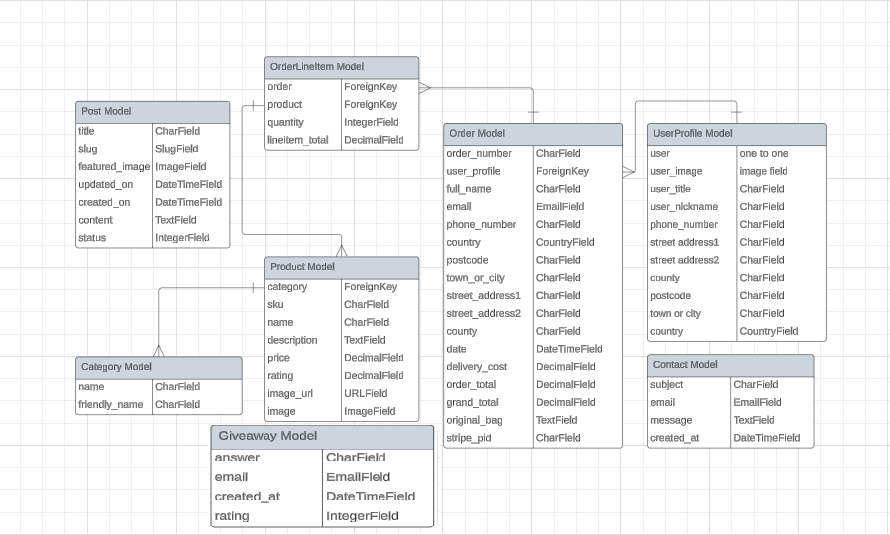

# MATES E-SHOP

## E-commerce Store for Chess Enthusiasts
> The e-commerce chess store sells a variety of chess sets and accessories online, providing a convenient shopping experience for chess enthusiasts of all levels.

### - By Tomas Karavasilev

## **[LIVE SITE](https://matesapp-6452160599de.herokuapp.com/) | [REPOSITORY](https://github.com/Karoskodev/mates)**

---

## Table of contents
<a name="contents">Back to Top</a>
 1. [ UX ](#ux)
 2. [ Business Model ](#business)
 3. [ SEO ](#seo)
 4. [Agile Development](#agile)
 5. [ Features ](#features)  
 6. [ Features Left to Implement ](#left)  
 7. [ Technology used ](#tech) 
 8. [ Testing ](#testing)  
 9. [ Bugs ](#bugs)  
 10. [ Deployment](#deployment)
 11. [ Credits](#credits)
 12. [ Content](#content)  
 13. [ Acknowledgements](#acknowledgements)  

 ---

 ## UX

 
 ### Color pallete

 I tried to stick with the colors reminiscent of the chessboard, chess pieces and wood.
  
 
 

 ### Database Schema

 

 ---
### Models
 

#### User Profile Model

| id | Field |
|--|--|
|user|OneToOneField|
|user_image|imagefield|
|user_title|charfield|
|user_nickname|charfield|
|phone_number|charfield|
|street address1|charfield|
|street address2|charfield|
|county|charfield|
|postcode|charfield|
|town or city|charfield|
|country|countryfield|

#### Order Model

| id | Field |
|--|--|
|order_number|CharField|
|user_profile|ForeignKey|
|full_name|CharField|
|email|EmailField|
|phone_number|CharField|
|country|CountryField|
|postcode|CharField|
|town_or_city|CharField|
|street_address1|CharField|
|street_address2|CharField|
|county|CharField|
|date|DateTimeField|
|delivery_cost|DecimalField|
|order_total|DecimalField|
|grand_total|DecimalField|
|original_bag|TextField|
|stripe_pid|CharField|

#### OrderLineItem Model

| id | Field |
|--|--|
|order|CharField|
|product|ForeignKey|
|quantity|CharField|
|lineitem_total|EmailField|

#### Product Model

| id | Field |
|--|--|
|category|ForeignKey|
|sku|CharField|
|name|CharField|
|description|TextField|
|price|DecimalField|
|rating|DecimalField|
|image_url|URLField|
|image|ImageField|

#### Category Model

| id | Field |
|--|--|
|name|CharField|
|friendly_name|CharField|

#### Post Model

| id | Field |
|--|--|
|title|CharField|
|slug|SlugField|
|featured_image|DateTimeField|
|updated_on|DateTimeField|
|created_on|DecimalField|
|content|TextField|
|status|IntegerField|

#### Contact Model

| id | Field |
|--|--|
|subject|CharField|
|email|EmailField|
|message|TextField|
|created_at|DateTimeField|

## UX design

### Wireframes

 
Main page:

 
Products page:

 
Product Detail page:

 
Shoping Bag page:

 
Blog page:

 
Contact form page:

 
---

## Business Model

#### Business Overview
Mates Chess Eshop is a B2C e-commerce platform specializing in chess-related products, aiming to provide high-quality chess sets, boards, and accessories to customers worldwide through an online store.

Benefits for the Business Owner:
1. Scalability: Easily expand the business as it grows.
2. No Physical Location: No need for a brick-and-mortar store, allowing for global reach.
3. Global Targeting: Cater to customers worldwide, targeting chess enthusiasts.
4. Niche Branding: Focus on a specific niche, building a brand that resonates with chess players.
5. Low Startup Cost: Begin with a relatively low initial investment, allocating more budget to customer acquisition and marketing.
6. Impulse Buying: The lower price point encourages impulse purchases from customers.

Cons:
1. Initial Customer Acquisition: Overcoming industry saturation to attract initial customers.
2. Brand Establishment: Building a brand from scratch requires time and a solid marketing strategy.
3. Marketing Effort: Manual marketing or paid advertising is essential for gaining organic traffic.
4. Trust Building: Absence of physical presence may make it challenging to build trust without discounts or offers.

---

#### Site User

User 1:
The typical site user is a chess enthusiast, male, aged between 10 and 80, interested in chess. They seek quality chess products to enhance their gaming experience.

User 2:
Additional users include partners of User 1, browsing for gifts catering to the chess interest.

---

#### Goals for the Website:

User-Friendly Interface: Ensure an easy-to-navigate website with a clear purpose.
Product Satisfaction: Provide products that meet user expectations.
Quick Checkout: Facilitate a seamless checkout process.
User Profiles: Enable users to create profiles, view past orders, and update information.

---

Marketing Strategy

Goals:

1. Facebook Promotion: Leverage the Facebook business page for store promotion.
2. Social Network Sharing: Encourage friends and family to share the page, enhancing visibility.
3. Soft Launch Sale: Initiate a soft online launch sale to stimulate early adoption and purchases.
4. Subscriber Engagement: Use Mailchimp to gather subscribers and send promotions for repeat business.
5. SEO Content: Develop meaningful articles and blog posts to enhance SEO ranking on search engines.
6. Paid Advertising: Utilize platforms like Google Ads and Facebook Ads to reach the target demographic.
7. Product-Centric Ads: Run multiple ads featuring different chess products, analyzing and focusing on high-performing ones.
8. Influencer Collaboration: Consider promoting custom-made products through influencers in the chess niche, targeting those with at least 10k followers.
9. By following this strategy, Mates Chess Eshop aims to establish itself as a go-to platform for chess enthusiasts, offering a seamless online shopping experience and valuable content to build a loyal customer base.

